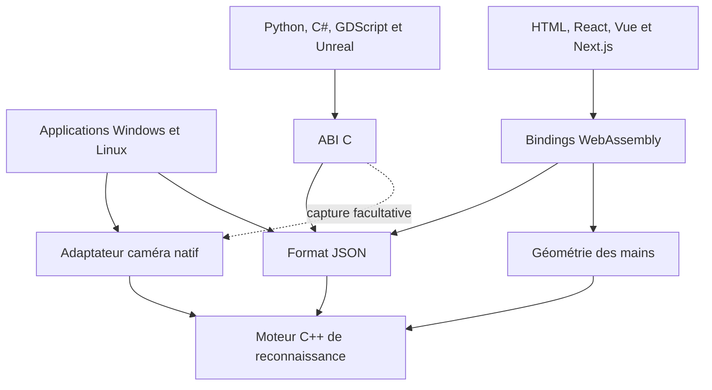

# Architecture du dépôt et contrats

[English](overview.md) | [Français](overview.fr.md)

<details>
<summary>Dans cette page</summary>

- [Carte du dépôt](#carte-du-dépôt)
- [Modules](#modules)
- [Dépendances et points d'entrée](#dépendances-et-points-dentrée)
- [Compilation, validation et distribution](#compilation-validation-et-distribution)
- [Où modifier une fonctionnalité](#où-modifier-une-fonctionnalité)
- [Exécution et propriété](#exécution-et-propriété)
- [Disponible et prévu](#disponible-et-prévu)
- [Interface du contrôleur](#interface-du-contrôleur)

</details>

Motion Input Grid (MIG) sépare observations, reconnaissance calibrée, configuration, estimation
facultative, sorties et présentation. Tous les hôtes utilisent le même moteur.
Le [pipeline](lifecycle.fr.md) décrit exécution/propriété, le [format](../reference/configuration.fr.md)
les données et les [performances](performance.fr.md) les coûts mesurés.


## Carte du dépôt

Ce guide présente l'architecture globale : modules sources, applications qui les
utilisent, compilation et artefacts générés. Les sections suivantes détaillent
les contrats d'exécution ; les guides liés décrivent les API et les plateformes.

```text
MIG/
  src/                  Moteur C++, adaptateurs natifs et applications desktop
  bindings/             Interfaces publiques Python, .NET et JavaScript
  integrations/         Add-ons/packages runtime Godot, Unity et Unreal
  ports/                Modèle du port vcpkg motion-input-grid
  VERSION               Version commune du moteur et des archives
  examples/             Tutoriels autonomes et assets canoniques
  tests/                Vérifications moteur, intégrations, interfaces et paquets
    core/, format/      Contrats du moteur et des configurations
    native/, apps/      Runtime caméra et règles des applications
    ui/                 Tests des applications Linux et Windows
    bindings/           Tests C ABI, Python, JavaScript et .NET
    examples/           Comportement des démos et découverte du runtime
    packaging/, tooling/  Validation des artefacts et outils de build/release
    benchmarks/         Mesures synthétiques des performances du moteur
  configs/              Profils de mouvements d'exemple
  cmake/                Dépendances et configuration du SDK installé
  tools/                bootstrap/, build/, packaging/, release/, web/, dev/, lib/, docker/
  .github/workflows/    Tâches automatisées de compilation et validation
  docs/                 Guides, contrats et revues historiques
    fr/                 Traductions françaises du README et des politiques racine
  CMakeLists.txt        Sélection des cibles natives/portables/WebAssembly
  CMakePresets.json     Configurations CMake nommées
  package.json          Workspaces JavaScript et commandes communes
  vcpkg.json            Dépendances natives
  .clang-format         Règles de formatage C++
  build/                Binaires, dépendances, tests et archives générés
  install/              SDK local si ce préfixe d'installation est choisi
  distribution/         Préparation des distributions générées
```

`build`, `install`, `distribution`, `node_modules` et les sorties des frameworks
sont générés localement. Modifiez les sources, pas leurs copies dans ces dossiers.

## Modules

| Dossier / cible | Responsabilité |
| --- | --- |
| src/core / MIG::core | Corps fixe, calibrage, contraintes spatiales/doigts/signes, événements et maintien actif |
| src/format / MIG::format | Schéma 2 strict, validation, lectures bornées, sauvegarde atomique |
| src/hands / MIG::hands | Mains à 21 points, association anatomique, géométrie des doigts |
| src/face / MIG::face | Squelette de module facial facultatif, sans estimateur |
| src/native / MIG::native | Capture Windows/Linux, tâches/résultats MediaPipe et conversion |
| src/c-api / MIG::c | ABI 1 handles/paquets, bibliothèque partagée et capture facultative |
| src/web | Même moteur exposé par les bindings C++/JavaScript Emscripten |
| src/controller | Copies des profils, noms et dernière sélection ; partagé par les deux contrôleurs |
| src/apps | UI Win32, brouillons/historique, workers et consentement |
| src/linux-apps | UI Qt, worker propriétaire de capture/moteur, ordonnanceur partagé |
| bindings | ctypes Python, pont C#, session npm et adaptateurs |
| examples | Application, intégration, profil et utilitaires locaux à chaque tutoriel |
| tests | Régressions CTest, vérifications des langages/interfaces/navigateurs et archives |
| tools, cmake, workflows | Compilation, dépendances épinglées, contrôles et paquets locaux |
| configs, docs | Données d'exemple et contrats |

Le core n'importe ni caméra ni UI. Le remplacement de définition est une opération
hors boucle temps réel ; le moteur possède des définitions immuables validées et
un état réutilisé. Surlignage, layer sélectionné et consentements ne sont pas du
JSON. Les layers regroupent les contraintes existantes, sans second modèle.

## Dépendances et points d'entrée

`core` ne dépend ni d'une interface, ni d'une caméra, ni d'un modèle. `format` et
`hands` utilisent ce moteur ; `format` utilise nlohmann/json pour les fichiers.
L'adaptateur natif convertit les résultats caméra/modèles en observations pour le
moteur. L'ABI C relie format/moteur et, selon la compilation, mains et capture.
La cible WebAssembly relie core, format et hands avec Emscripten : l'algorithme
de reconnaissance n'est pas réécrit en JavaScript.



Le schéma représente les principaux chemins d'utilisation, pas chaque dépendance
du linker. Les applications produisent `mig-configurator` et `mig-controller`.
Le configurateur crée les profils ; le contrôleur importe des copies gérées et
les exécute. Les interfaces sont séparées, mais reconnaissance, persistance des
profils et ordonnanceur de sortie sont partagés. Win32/GDI se trouve dans
`src/apps`, Qt6 dans `src/linux-apps`.

Les en-têtes C++ publics sont dans les dossiers `include/mig` des bibliothèques.
L'en-tête ABI C est `src/c-api/include/mig/c/api.h`. `bindings/python` l'utilise
avec ctypes ; `bindings/dotnet` fournit le tracker C# réutilisable. Le pont
GDScript se trouve dans `integrations/godot/native`, ses scènes dans `examples/godot/gdscript` ; les
exemples C# sont dans `examples/godot/csharp`. Unity utilise le pont .NET ; Unreal
utilise directement l'ABI C.

`examples/web/session.mjs` gère la session navigateur commune. L'interface HTML
et les adaptateurs React/Vue de `bindings/javascript` l'utilisent. Next.js reprend
son propre composant React côté client, sans dossier d’exemple voisin. `tools/web/prepare-javascript.mjs` copie les sources
canoniques de la session, WASM et assets dans le runtime npm ; ces copies générées
ne sont pas des implémentations indépendantes. Voir [JavaScript](../integrations/javascript.fr.md).

`example_usage` expose l’intégration Python/C++, avec utilitaires locaux
`support/`. `examples/common` conserve profils/polices/fixtures du dépôt. SDL2/SFML utilisent les bibliothèques C++ ; Tkinter/Pygame
utilisent le pont ABI Python. Les consommateurs console montrent les points
d'entrée avec observations fournies ou estimateur natif. Les variantes et leur
installation figurent dans l'[index des exemples](../../examples/README.fr.md).

## Compilation, validation et distribution

Les options CMake racine choisissent bibliothèques portables, mains/face, ABI C,
capture native, applications et WebAssembly. Le SDK avec observations fournies
n'exige ni caméra ni runtime MediaPipe. Les applications natives ajoutent capture
et modèles ; les applications Linux demandent aussi Qt6 et X11/XTest. Le navigateur
utilise MediaPipe Tasks Vision pour estimer les points, puis le même moteur compilé.

`tools/build/build-windows.ps1` et `tools/build/build-linux.sh` préparent, compilent et testent
les cibles natives. `cmake/` exporte les cibles `MIG::` pour les consommateurs avec
`find_package(MIG)`. Les workspaces JavaScript partagent le paquet navigateur ;
les guides Python/.NET et les README des exemples décrivent leurs autres points
d'installation et de compilation.

CTest vérifie reconnaissance, configuration, coordonnées, ressources natives et
interfaces desktop. Des tests Python, .NET, Node/navigateur et Godot vérifient les
frontières des langages et les exemples. Les contrôles d'archives vérifient
manifestes et sommes de contrôle. Le [guide des tests](../../tests/README.fr.md)
décrit leur exécution ; le [guide des outils](../../tools/README.fr.md) explique
comment compiler et distribuer votre intégration.

Les outils de packaging rassemblent bibliothèques, binaires, modèles, licences et
sources dans `build` ou `distribution`, puis produisent dans `build/releases` les
archives natives, SDK/paquets Debian, wheel/sdist Python, paquet npm, exemples
exécutables et bundles de sources pour éditeurs. Les wrappers Python/npm ne
remplacent pas le moteur compilé. Les sources pour éditeurs exigent éditeur et
dépendances natives ; elles ne sont pas des jeux exportés. Voir
[package installation](../getting-started/packages.fr.md) et [validation des plateformes](../reference/support.fr.md).

## Où modifier une fonctionnalité

| Modification | Sources et vérifications |
| --- | --- |
| Reconnaissance ou coordonnées | `src/core`, éventuellement `src/hands`, régressions CTest |
| Champs persistants d'un profil | `src/format`, définitions core, tests et [guide JSON](../reference/configuration.fr.md) |
| Cycle de vie caméra/modèles | `src/native`, tests capture/conversion et guide plateforme |
| Création desktop ou vues du contrôleur | `src/apps` / `src/linux-apps`, profils partagés dans `src/controller` |
| API publique d'un langage | `src/c-api`, `src/web` ou `bindings`, tests des consommateurs |
| Session navigateur et frameworks | `examples/web/session.mjs`, `bindings/javascript`, tests frameworks |
| Comportement d'un exemple | Dossier de la technologie et ses fichiers locaux `example_usage`/`support`, tests des exemples |
| Compilation ou contenu d'archive | `cmake`, `tools`, workflows, tests des paquets/manifestes |

Conservez la gestion des données d'exécution dans les couches décrites ci-dessous.
Une modification d'interface ne doit pas créer un second moteur de reconnaissance
ou un second modèle de profil persistant.

[Reconnaissance et coordonnées](recognition.fr.md)

## Exécution et propriété

Windows publie quatre buffers réutilisés avec leases dans une boîte au dernier
état. L'inférence possède modèles/core ; les révisions rejettent les résultats
dépassés. L'UI affiche la dernière capture indépendamment. Linux utilise un
worker caméra/modèles/moteur avec snapshots copiés ; remplacer un profil arrête
et rejoint ce worker. Les événements sont bornés et les sorties périmées rejetées.

Single press exécute une fois ; Hold exécute le préfixe puis maintient le dernier
accord ; Repeat rejoue sans chevauchement ni rattrapage. L'ordonnanceur compte
les propriétaires des touches et libère sur perte des conditions, ancienneté,
Stop, dialogues, Test ou consentement retiré. Windows utilise SendInput ; Linux
X11/XTest, sans injection Wayland native. Les SDK émettent événements/état seulement.

Python/C# encapsulent le même handle sérialisé. Poll natif reconnaît déjà :
pas de second update. Les pixels empruntés expirent au poll suivant et sont copiés
avant un autre thread. La session navigateur possède caméra, tâches, WASM et
générations d'annulation. React/Vue observent statut/actions ; Next n'ouvre les
ressources qu'après le geste utilisateur, jamais en SSR.

## Disponible et prévu

Windows possède thèmes, logs, dessin Basic/Pro, sauvegarde de layer, doigts,
séquences clavier, enregistrement/revue et undo. Qt Linux conserve tous les champs
via Pro JSON, mais enregistrement interactif, outils avancés et undo restent à
porter. Face est un squelette. Gamepad, analogique, courbures, replay et façade SDK
threadée restent prévus. Aucune approximation de profondeur n'est une distance
caméra réelle. [Limites de publication](../reference/support.fr.md).

## Interface du contrôleur

Le contrôleur compile ses propres modules de profils et de vues, sans la fenêtre
de création du configurateur. Les deux plateformes partagent la persistance des
profils et les contrats de reconnaissance/sortie. Un aperçu masqué évite la conversion
BGRX sous Windows et la copie QImage sous Linux. La vérification lit la progression
de l’action sélectionnée sans isoler le moteur et suspend les sorties clavier.
Voir le [contrôleur](../guides/controller.fr.md).

Les [packages distribuables](../getting-started/packages.fr.md) utilisent ces mêmes modules ;
les projets de démonstration restent dans `examples`.

Les tutoriels Python/C++ possèdent leur intégration `example_usage` et leurs
utilitaires `support/` locaux. `examples/common` conserve profils, polices et
fixtures du dépôt. Next possède sa propre vue/styles ; les packages individuels
ne dépendent pas d’un dossier d’exemple voisin.
