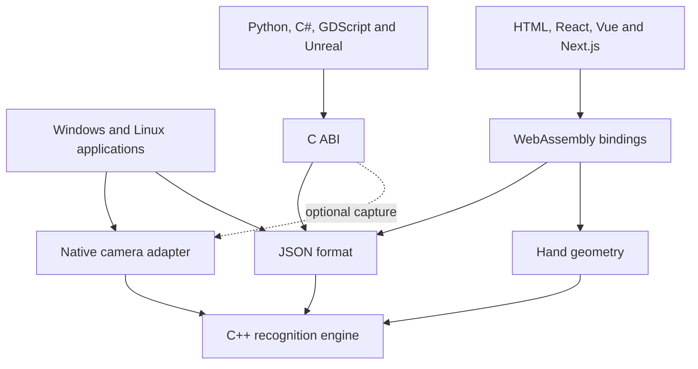

# Repository architecture and contracts

[English](overview.md) | [Français](overview.fr.md)

<details>
<summary>On this page</summary>

- [Repository map](#repository-map)
- [Module boundaries](#module-boundaries)
- [Dependencies and entry points](#dependencies-and-entry-points)
- [Build, verification and distribution](#build-verification-and-distribution)
- [Where to make a change](#where-to-make-a-change)
- [Scheduling and application ownership](#scheduling-and-application-ownership)
- [Implemented scope and plans](#implemented-scope-and-plans)
- [Controller presentation](#controller-presentation)

</details>

Motion Input Grid (MIG) separates supplied observations, calibrated recognition, configuration,
optional estimation, output and presentation. The same engine processes a profile
for every host. See [pipeline](lifecycle.md) for execution and ownership,
[configuration](../reference/configuration.md) for persisted semantics and
[performance](performance.md) for measured complexity.


## Repository map

This is the overall architecture guide. It covers source modules, their consumers,
build entry points and generated artifacts. The sections below describe the runtime
contracts; the linked guides provide API and platform details.

```text
MIG/
  src/                  C++ engine, native adapters and desktop applications
  bindings/             Python, .NET and JavaScript public interfaces
  integrations/         Runtime Godot, Unity and Unreal packages
  ports/                motion-input-grid vcpkg port template
  VERSION               Shared engine and archive version
  examples/             Consumer applications and shared demonstration code
  tests/                Recognition, integration, UI and packaging checks
    core/, format/      Engine and configuration contracts
    native/, apps/      Camera runtime and application policies
    ui/                 Linux and Windows application tests
    bindings/           C ABI, Python, JavaScript and .NET tests
    examples/           Demo behavior and runtime discovery
    packaging/, tooling/  Artifact validation and build/release helpers
    benchmarks/         Synthetic engine performance measurements
  configs/              Example motion profiles
  cmake/                Dependency resolution and installed SDK configuration
  tools/                Bootstrap, builds, validation and packaging
  .github/workflows/    Automated build and validation jobs
  docs/                 Guides and implementation contracts
    fr/                 French translations of root README/community policies
  CMakeLists.txt        Native/portable/WebAssembly target selection
  CMakePresets.json     Named CMake configurations
  package.json          JavaScript workspaces and shared scripts
  vcpkg.json            Native dependency manifest
  .clang-format         C++ formatting rules
  build/                Generated binaries, dependencies, tests and release archives
  install/              Local SDK installation when this prefix is selected
  distribution/         Generated distribution staging
```

`build`, `install`, `distribution`, `node_modules` and framework build outputs are
generated locally. Edit the source directories, not copies in those folders.

## Module boundaries

| Directory / target | Responsibility |
| --- | --- |
| `src/core` / `MIG::core` | Fixed body observations, grid calibration, spatial/finger/sign constraints, events and live terminal state |
| `src/format` / `MIG::format` | Strict schema-v2 parse/serialize, validation, bounded reads and atomic saves |
| `src/hands` / `MIG::hands` | Optional 21-point hands, anatomical association and finger geometry |
| `src/face` / `MIG::face` | Optional face add-on scaffold; no face estimator |
| `src/native` / `MIG::native` | Windows/Linux capture, MediaPipe task/result ownership and portable conversion |
| `src/c-api` / `MIG::c` | ABI-1 handle/packet façade; shared library and optional capture |
| `src/web` | Same engine exposed through Emscripten C++/JavaScript bindings |
| `src/controller` | Managed profile copies, names and last selection; shared by both desktop controllers |
| `src/apps` | Win32 presentation, drafts/history, capture/inference workers and output consent |
| `src/linux-apps` | Qt presentation and worker-owned capture/engine; shared output scheduler |
| `bindings` | Python ctypes, C# bridge and npm session/framework adapters |
| `examples` | Small application consumers and shared demo sources/profile |
| `tests` | Portable CTest regressions, language/GUI/browser checks and archive validation |
| `tools`, `cmake`, `.github/workflows` | Reproducible build, pinned bootstrap, validation and local packaging |
| `configs`, `docs` | Sample data and documented contracts |

Do not import camera or UI types into core. Definition replacement is a cold
operation; an engine owns immutable validated definitions and reusable progress.
No live highlight, layer selection, camera permission or output consent belongs
in JSON. Layers group existing landmark constraints; they are not another model.

## Dependencies and entry points

`core` has no UI, camera or model dependency. `format` and `hands` depend on it;
`format` uses nlohmann/json for persistence. Native estimation converts camera/model
results into engine observations. The C ABI links the format/engine and optionally
hands/native capture. The WebAssembly target links core, format and hands through
Emscripten bindings; it is not a port of the recognition algorithm to JavaScript.



The diagram shows the main consumption paths, not every linker dependency.
Desktop apps produce `mig-configurator` and `mig-controller`. The configurator
authors profiles; the controller imports managed copies and runs them. Their
interfaces are separate, while recognition, profile persistence and output
scheduling are shared. Win32/GDI lives in `src/apps`; Qt6 lives in `src/linux-apps`.

Public C++ headers live under each library's `include/mig` directory. The C ABI
header is `src/c-api/include/mig/c/api.h`. `bindings/python` wraps that ABI with
ctypes; `bindings/dotnet` provides the reusable C# tracker. Godot's GDScript bridge
lives in `integrations/godot/native`; its scenes stay in `examples/godot/gdscript`. C# examples live
in `examples/godot/csharp`. Unity uses the .NET bridge; Unreal consumes the C ABI.

`examples/web/session.mjs` owns the shared browser session. The plain HTML viewer
and `bindings/javascript` React/Vue adapters consume it. Next.js reuses the React
component inside a client boundary. `tools/prepare-javascript.mjs` stages canonical
session sources, WASM and assets into the npm runtime; generated copies are not
independent implementations. See [JavaScript](../integrations/javascript.md).

`examples/common` shares profiles, input sources and presentation helpers for the
Python/C++ viewers. SDL2/SFML use the C++ libraries; Tkinter/Pygame use Python's
ABI wrapper. The supplied-landmarks and native-estimator console consumers show
the two lower-level entry points. Visual integrations have demo/import examples and
setup instructions in the [example index](../../examples/README.md).

## Build, verification and distribution

The root CMake options select portable libraries, optional hands/face, the C ABI,
native capture, desktop apps and WebAssembly. A supplied-landmarks SDK needs no
camera or MediaPipe runtime. Native apps add platform capture and model/runtime
dependencies; Linux apps also require Qt6 and X11/XTest. Browser estimation uses
MediaPipe Tasks Vision, then passes observations to the same compiled engine.

`tools/build-windows.ps1` and `tools/build-linux.sh` bootstrap/build/test native
targets. `cmake/` exports installed `MIG::` targets so external consumers can use
`find_package(MIG)`. JavaScript workspaces share the browser package; individual
Python/.NET/example guides describe their installation and build paths.

CTest verifies engine semantics, configuration, coordinate conversion, native
ownership and desktop UI. Separate Python, .NET, Node/browser and Godot checks
exercise language boundaries and examples. Archive checks verify manifests and
checksums. `.github/workflows/ci.yml` combines these build families; release
workflows prepare artifacts. Publication remains a separate manual operation.

Packaging tools stage libraries, binaries, model assets, licenses and sources
under `build` or `distribution`, then create files in `build/releases`: native
archives, C++ SDK/Debian packages, Python wheel/sdist, npm package, runnable examples
and editor-source bundles. Python/npm wrappers do not replace the compiled engine.
Editor-source bundles need their editor and native dependencies; they are not
exported games. See [package installation](../getting-started/packages.md) and
[platform validation](../reference/support.md).

## Where to make a change

| Change | Source and checks |
| --- | --- |
| Recognition or coordinate semantics | `src/core`, optional `src/hands`, CTest regressions |
| Persisted profile fields | `src/format`, core definitions, schema tests and [format guide](../reference/configuration.md) |
| Camera/model lifecycle | `src/native`, native conversion/capture tests and platform guide |
| Desktop authoring or controller views | `src/apps` / `src/linux-apps`; shared profiles in `src/controller` |
| Public language API | `src/c-api`, `src/web` or `bindings`; matching consumer tests |
| Browser lifecycle/framework integration | `examples/web/session.mjs`, `bindings/javascript`, framework tests |
| Example behavior | Technology folder and shared `examples/common`; example tests |
| Build or archive contents | `cmake`, `tools`, workflows and package/manifest tests |

Keep runtime data ownership in the layers described below. A presentation change
should not create a second recognition engine or a second persisted profile model.

[Recognition and coordinates](recognition.md)

## Scheduling and application ownership

Windows capture publishes four reusable leased buffers to a latest-frame mailbox.
An inference worker owns models/core; revisions reject obsolete results. The UI
reads latest capture independently of inference. Linux uses one worker owning
capture/models/engine and copied latest snapshots; replacing a profile stops and
joins that worker first. Both use bounded events and reject stale output.

Single press executes once. Hold executes a prefix then owns the final chord.
Repeat replays without overlapping/catch-up work. The shared output scheduler
reference-counts key ownership and releases on lost conditions, stale data, Stop,
dialogs, Test or disabled consent. Windows uses SendInput; Linux uses X11/XTest
and cannot inject native Wayland keys. SDKs emit logical events/live state only.

Python/C# wrap the same serialized ABI handle. Native polling already recognizes
the packet; do not call update again. Preview bytes are borrowed until the next
poll and copied before crossing UI threads. Browser sessions own camera, tasks,
WASM and cancellation generations. React/Vue only observe status/action snapshots;
Next starts browser resources after a user gesture, never in SSR.

## Implemented scope and plans

Windows has modern light/dark UI, linked logs, Basic/Pro drawing, layer save,
scoped fingers, keyboard sequences, recording/review and undo. Linux has a native
Qt UI and complete-profile Pro JSON, but interactive recording, advanced drawing
and undo have not all been ported. Face is a scaffold, not face inference.
Virtual gamepad, analog output, curvature matching, replay and a packaged threaded
SDK camera-session facade remain plans. No depth proxy is advertised as metric
camera distance. See [release preparation](../reference/support.md) for platform limits.

## Controller presentation

The controller compiles dedicated profile/view modules instead of the configurator
authoring window. Both platforms share managed profile persistence and the existing
recognition/output contracts. Hidden previews skip Windows BGRX conversion and Linux
QImage copies. Verification reads selected-input progress without isolating the
engine, and pauses output. See [controller](../guides/controller.md).

The [distributable packages](../getting-started/packages.md) use these same modules; demo
projects remain under `examples`.
