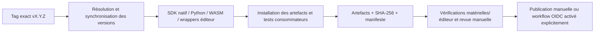

# Distribution des packages

[English](distribution.md) | [Français](distribution.fr.md)

Motion Input Grid (MIG) 1.0.0 distribue un moteur de reconnaissance unique via le SDK C++, son ABI C
et Emscripten. Python utilise ctypes, Unity le pont .NET partagé, Godot la
GDExtension existante et Unreal un pont vers l'ABI C. Les intégrations ne recopient
pas la reconnaissance. Les packages runtime utilisent les points anatomiques
fournis par votre estimateur. Les applications caméra et leurs modèles restent
dans des archives séparées.

## Noms du projet et des packages

Motion Input Grid (MIG) est le nom du projet. PyPI, npm, Debian et le port vcpkg
utilisent `motion-input-grid`. Les archives SDK, natives et d’intégration suivent
`motion-input-grid-<version>-<plateforme>-<type>`. Le tarball npm se nomme
`motion-input-grid-<version>.tgz` et les packages Debian
`motion-input-grid_<version>_<architecture>.deb`. Les wheels et sdists Python
emploient le nom de fichier normalisé `motion_input_grid`. Le package Unity UPM
s'appelle `com.robin-g0.motion-input-grid`, selon sa convention de domaine inversé.
Le module Python reste `mig`, les exports CMake restent `MIG::*` et les noms
techniques des bibliothèques, API et binaires d'exemples sont conservés.

Après publication dans les registres correspondants :

```sh
python -m pip install motion-input-grid
npm install motion-input-grid
sudo apt install motion-input-grid
vcpkg install motion-input-grid --overlay-ports=/chemin/motion-input-grid-vcpkg-overlay
```

APT nécessite le dépôt signé décrit ci-dessous. vcpkg utilise l'overlay de release
généré tant qu'une soumission au registre n'est pas acceptée. La publication
reste séparée de la préparation de ces artefacts.

## Version et compilation de publication

Un tag exact `vX.Y.Z` fournit la version de publication. Sans tag exact ou sans
`.git`, `VERSION` fournit la version de développement/archive source. CMake indique
la source utilisée. Synchroniser les métadonnées de tous les packages avec :

```sh
python tools/release-version.py --sync --tag v1.0.0
```

La commande propage la version résolue vers Python, npm, vcpkg et les packages
moteurs. Chaque job de publication la lance après checkout ; aucun tag n'est créé.

[Prepare release candidates](../../.github/workflows/release-check.yml) s'exécute sur
les tags de publication ou manuellement. Il réutilise les compilations natives,
l'installation SDK et les générateurs d'exemples, puis vérifie wheels, npm, SDK,
vcpkg, Debian et intégrations. L'artefact Actions final contient `SHA256SUMS` et
`release-manifest.json`. Les permissions sont en lecture seule ; aucune release
ni aucun package n'est publié automatiquement. Le job Linux fournit le sdist
canonique et Windows fournit sa wheel séparément.

Pour une préparation locale, utilisez un dossier neuf tel que
`build/release-candidates/1.0.0`. N'y mélangez pas les previews ou d'anciennes
versions. Générez l'inventaire après validation :

```sh
python tests/package_artifact_tests.py build/release-candidates/1.0.0
python tools/release-manifest.py build/release-candidates/1.0.0 --tag v1.0.0
python tools/release-checksums.py build/release-candidates/1.0.0 --check
```

Le manifeste indique le nom du projet, l'identifiant de distribution, le dépôt,
les noms des artefacts, leurs tailles et SHA256. Les anciens identifiants de
packages sont refusés. C'est un inventaire, pas une
signature ni une preuve de validation matérielle ou dans les éditeurs. Conservez
le rapport de validation avec les notes de publication.

## SDK C++ et vcpkg

Compilez un SDK de positions avec applications et runtime natif désactivés.
Installez-le avec `cmake --install`, puis archivez cette installation :

```sh
python tools/package-sdk.py --sdk build/release-sdk-x64-install \
    --dependencies build/native-linux-deps --platform linux-x64
python tests/sdk_package_tests.py build/releases/motion-input-grid-1.0.0-linux-x64-sdk.tar.gz
```

L'archive conserve en-têtes, bibliothèques, exports CMake relocalisables et licences.
Le test extrait l'archive et compile un consommateur externe strict utilisant
`find_package(MIG CONFIG REQUIRED)`, sans repli vers les sources. Windows nécessite
un toolset/runtime MSVC compatible ; Linux cible glibc 2.35+ et GCC 11+.
Les tests SDK ARM64 utilisent QEMU ; mesurez les performances sur du matériel ARM64.

`tools/package-source.py` crée les sources du moteur et l'overlay de
[ports/motion-input-grid](../../ports/motion-input-grid/README.fr.md). Il fixe le SHA512 réel et la future URL
GitHub Release. Le test utilise le cache avant l'upload ; testez l'URL publique
sans cache après votre upload manuel. Le `vcpkg.json` racine reste le manifeste
des dépendances, pas le port de distribution. Une proposition à vcpkg ou une
publication dans votre registre restent manuelles.

## Python et npm

```sh
python -m pip install build twine
python tools/package-python.py --dependencies build/native-linux-deps
python tests/python_package_tests.py chemin/vers/la-wheel-générée.whl
```

Utilisez une wheel adaptée à l'hôte de test. Le générateur place les sources C++
canoniques et les en-têtes JSON dans le sdist, puis compile la wheel depuis ce
sdist. Il ne faut ni autre checkout MIG ni téléchargement de dépendance MIG pour
le recompiler ; le frontend peut télécharger ses outils de compilation.
Les wheels contiennent l'ABI C de positions et ses licences.
`Tracker(None, json)` sélectionne la bibliothèque incluse ; un chemin explicite
permet toujours d'utiliser un SDK externe avec caméra.

Les wheels Windows utilisent le runtime MSVC statique. Celles de Linux utilisent
les runtimes GCC statiquement et incluent notices et clauses d'exception.
Réparez les tags avec `auditwheel repair --plat manylinux_2_35_x86_64` ou
`manylinux_2_35_aarch64`, puis testez la wheel réparée. Installez un `patchelf`
récent avec auditwheel. Ne publiez pas la wheel intermédiaire `linux_*` ni une
ancienne wheel `none-any`. `--linux-arm64` utilise le toolchain de compilation
croisée existant ; testez la wheel avec Python ARM64, pas avec un interpréteur x64.
Le package autonome n'inclut aucun estimateur caméra.
La [configuration scikit-build-core](https://scikit-build-core.readthedocs.io/en/stable/configuration/index.html)
décrit le tag d'API `py3` utilisé avec ctypes.

La [préparation JavaScript](../integrations/javascript.fr.md) existante compile le moteur WASM et
prépare les assets navigateur. Lancez `npm pack --workspace motion-input-grid`,
puis `node tests/npm_package_tests.mjs <archive.tgz>`. Le test installe l'archive
dans un projet séparé, importe l'API publique, copie les assets et exécute la
reconnaissance WASM native. React/Vue restent des dépendances peer optionnelles ;
Next.js utilise l'adaptateur React. Aucun pont Node-API n'est nécessaire.

Vérifiez les métadonnées avec `python -m twine check`, les noms et droits des
registres, puis effectuez l'upload PyPI/npm manuellement après validation.

## Debian et hébergement APT signé

La configuration CPack existante produit `motion-input-grid` pour amd64 et arm64. Elle
contient SDK C++ et ABI C partagée, sans application ni estimateur. Activez
`MIG_PACKAGE_SDK=ON`, utilisez `/usr` comme préfixe et désactivez applications
et runtime natif. Renseignez votre identité réelle dans `MIG_PACKAGE_MAINTAINER`
avant publication. Testez l'installation dans un environnement Debian/Ubuntu jetable.

Sous Linux, installez `dpkg-dev`, `apt-utils` et `gnupg`. Gardez la clé privée et
sa sauvegarde hors du checkout. Créez/vérifiez cette clé manuellement, puis utilisez
son empreinte complète avec un dossier GPG existant :

```sh
python tools/build-apt-repository.py build/releases/motion-input-grid_1.0.0_amd64.deb \
    build/releases/motion-input-grid_1.0.0_arm64.deb --destination build/apt-candidate \
    --signing-key EMPREINTE_COMPLÈTE --gnupg-home /dossier/gpg-sécurisé
python tests/debian_package_tests.py build/releases/motion-input-grid_1.0.0_*.deb
```

Le générateur crée les index propres à chaque architecture, leurs versions
compressées, un fichier Release valable 30 jours, `InRelease`, `Release.gpg` et
un trousseau **public** exporté. Il exige un dossier neuf, ne crée pas de clé
de production et n'effectue aucun upload. Le test crée une clé jetable, vérifie
les deux signatures, actualise des index APT isolés et télécharge le vrai package.

Servez `pool`, `dists` et le trousseau public par HTTPS. Vérifiez l'empreinte par
un canal fiable et installez le trousseau public à
`/usr/share/keyrings/motion-input-grid-archive-keyring.gpg`. Exemple Deb822 dans
`/etc/apt/sources.list.d/motion-input-grid.sources` :

```text
Types: deb
URIs: https://VOTRE_HÔTE/motion-input-grid/
Suites: stable
Components: main
Signed-By: /usr/share/keyrings/motion-input-grid-archive-keyring.gpg
```

Remplacez l'hôte : aucun dépôt APT hébergé n'est fourni. Actualisez et signez avant
l'expiration ; publiez chaque génération complète atomiquement. Conservez les
anciens packages référencés et distribuez la nouvelle clé publique avant sa
rotation. La confiance APT utilise un trousseau propre au dépôt avec `Signed-By`,
comme décrit dans [apt-secure](https://manpages.debian.org/bookworm/apt/apt-secure.8.en.html).
Signature, hébergement HTTPS et soumissions aux registres/distributions restent manuels.

## Intégrations et limites de validation

`tools/package-integrations.py` génère les packages depuis un SDK installé :

| Intégration | Artefact | Contenu runtime | Validation |
| --- | --- | --- | --- |
| [Godot](../../integrations/godot/README.fr.md) | ZIP add-on | GDExtension, ABI C, notices godot-cpp/JSON/MIG | Import headless dans un projet neuf, reconnaissance et cycle de vie |
| [Unity](../../integrations/unity/README.fr.md) | UPM `.tgz` | Pont .NET existant, assembly definition, plugin natif filtré | Pont .NET extrait et ABI C incluse ; éditeur/export joueur à vérifier |
| [Unreal](../../integrations/unreal/README.fr.md) | ZIP plugin | Module runtime source, en-tête et bibliothèque ABI C | ABI C incluse ; compilation du module et export jeu à vérifier |

Le pont Godot vit dans `integrations/godot/native` ; le CMake de l'exemple l'appelle.
Les démos restent dans `examples`. Les packages contiennent le runtime nécessaire,
sans SDK complet, modèle caméra ou copie de reconnaissance. Utilisez l'architecture
adaptée. Unity desktop cible Windows/Linux x64 ; SDK et Unreal Linux ARM64 sont
produits séparément. Godot ARM64 nécessite son pont compilé et une validation
éditeur/export adaptée.

Avant publication, vérifiez les estimateurs réels, les exports et le démarrage sur
vos machines supportées. Le workflow Actions est préparé mais ne s'exécute pas
par une simple validation locale. Après le push manuel du tag, téléchargez et
inspectez ses artefacts, puis choisissez ceux à placer dans une GitHub Release.

[Support et maturité](../reference/support.fr.md)

## Publication future dans les registres

Le [modèle PyPI](../../.github/workflow-templates/publish-pypi.yml.disabled)
est désactivé : il est hors du dossier workflows et porte le suffixe `.disabled`.
Pour l'activer plus tard, configurer un Trusted Publisher PyPI avec le propriétaire
`Robin-G0`, le dépôt `MIG`, le workflow `publish-pypi.yml` et l'environnement `pypi`.
Protéger cet environnement GitHub par une approbation de revue. Pour la première
publication, configurer un éditeur en attente selon la [documentation PyPI](https://docs.pypi.org/trusted-publishers/adding-a-publisher/).
Copier ensuite le modèle vers `.github/workflows/publish-pypi.yml` et le lancer
manuellement sur le tag choisi avec l'identifiant du run de validation réussi.
Le workflow vérifie le commit, les empreintes et ne publie que les wheels et le
sdist. OIDC fournit des identifiants temporaires ; aucun token permanent n'est
nécessaire. Aucune publication n'a été exécutée.

Le [modèle npm](../../.github/workflow-templates/publish-npm.yml.disabled) est aussi
désactivé. Configurer le Trusted Publisher du package pour `Robin-G0/MIG`,
`publish-npm.yml` et l'environnement protégé `npm` avant de déplacer ce modèle.
Il utilise un runner GitHub, Node 24, npm 11.11 et OIDC, puis publie le tarball
validé avec provenance. Vérifier les droits sur `motion-input-grid` et effectuer
manuellement l'enregistrement initial si nécessaire. Les [règles npm](https://docs.npmjs.com/trusted-publishers/)
décrivent les prérequis et limites de première publication. Aucune publication
ni configuration du registre n'a été effectuée.

Pour une publication directe, autoriser explicitement `npm publish` dans le Trusted Publisher ; les nouvelles configurations peuvent limiter les droits à la publication en attente.

## Pipeline du candidat



Les workflows de construction/validation ne publient aucun package. Les modèles
de publication restent inactifs tant qu'ils ne sont pas installés et configurés.
