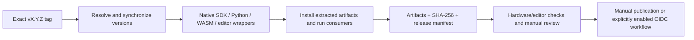

# Package distribution

[English](distribution.md) | [Français](distribution.fr.md)

Motion Input Grid (MIG) 1.0.0 distributes one recognition engine through the native C++ SDK, its C ABI
and Emscripten. Python uses ctypes, Unity uses the shared .NET bridge, Godot uses
the existing GDExtension, and Unreal wraps the C ABI. No integration duplicates
recognition. The runtime packages accept caller-supplied anatomical landmarks.
Camera-enabled desktop applications and their models remain separate artifacts.

## Project and package names

Motion Input Grid (MIG) is the project name. PyPI, npm, Debian and the vcpkg
port use `motion-input-grid`. SDK, native and integration archives use
`motion-input-grid-<version>-<platform>-<kind>`. The npm tarball is
`motion-input-grid-<version>.tgz`; Debian packages are
`motion-input-grid_<version>_<architecture>.deb`. Python wheels and sdists use
the standard normalized `motion_input_grid` filename. The Unity UPM identifier is
`com.robin-g0.motion-input-grid`, following its reverse-domain convention.
The Python module remains `mig`, CMake exports remain `MIG::*`, and native
libraries, APIs and example binaries keep their existing technical names.

After the corresponding registry publication, install with:

```sh
python -m pip install motion-input-grid
npm install motion-input-grid
sudo apt install motion-input-grid
vcpkg install motion-input-grid --overlay-ports=/path/to/motion-input-grid-vcpkg-overlay
```

APT requires the signed repository described below; vcpkg uses the generated
release overlay until a registry submission is accepted. Registry publication
is separate from preparing these artifacts.

## Version and release builds

An exact Git tag `vX.Y.Z` is the release version. Without an exact tag or `.git`,
`VERSION` provides the development/source-archive fallback. CMake reports which
source it used. Synchronize package manifests and workspace locks before packaging:

```sh
python tools/release-version.py --sync --tag v1.0.0
```

The command propagates the resolved version to Python, npm, vcpkg and engine
metadata; release jobs run it independently after checkout. No tag is created.

[Prepare release candidates](../../.github/workflows/release-check.yml) runs on release
tags or manually. It reuses the existing native build, SDK install and example
builders, then validates wheel, npm, SDK, vcpkg, Debian and integration artifacts.
Its final Actions artifact contains `SHA256SUMS` and `release-manifest.json`.
It has read-only repository permissions and performs no release or registry upload.
The Linux job provides the canonical sdist; Windows provides its wheel separately.

Use a fresh output directory for a local candidate, for example
`build/release-candidates/1.0.0`. Keep previews and older versions out of that
directory. Generate its inventory only after validation:

```sh
python tests/package_artifact_tests.py build/release-candidates/1.0.0
python tools/release-manifest.py build/release-candidates/1.0.0 --tag v1.0.0
python tools/release-checksums.py build/release-candidates/1.0.0 --check
```

The manifest records the project name, package identifier, repository, artifact
names, sizes and SHA256 hashes. Packages with obsolete identifiers are rejected.
It is an inventory, not a signature or proof of hardware/editor validation. Keep the validation
report alongside the release notes.

## C++ SDK and vcpkg

Build a positions-only SDK with applications and native runtime off. Install it
with `cmake --install`, then archive that install with `tools/package-sdk.py`:

```sh
python tools/package-sdk.py --sdk build/release-sdk-x64-install \
    --dependencies build/native-linux-deps --platform linux-x64
python tests/sdk_package_tests.py build/releases/motion-input-grid-1.0.0-linux-x64-sdk.tar.gz
```

The archive preserves installed headers, libraries, relocatable CMake exports
and licenses. The artifact test extracts it and builds a strict external consumer
using `find_package(MIG CONFIG REQUIRED)` with no source-tree fallback. Windows
needs a compatible MSVC toolset/runtime; Linux targets glibc 2.35+ and GCC 11+.
ARM64 SDK tests use QEMU; run performance tests on actual ARM64 hardware.

`tools/package-source.py` creates the engine source archive and an overlay based
on [ports/motion-input-grid](../../ports/motion-input-grid/README.md). The overlay records its actual SHA512 and
future GitHub release URL. The artifact test seeds the download cache before
upload; verify the uncached public URL after your manual upload. The root
`vcpkg.json` remains MIG's dependency manifest, not its distribution port.
An upstream vcpkg submission or private registry registration remains manual.

## Python and npm

```sh
python -m pip install build twine
python tools/package-python.py --dependencies build/native-linux-deps
python tests/python_package_tests.py path/to/generated.whl
```

Use the wheel matching the test host. The Python builder stages the canonical
C++ sources and JSON headers into the sdist, then builds the wheel from that
sdist. Rebuilding requires no MIG checkout or dependency download; the build
frontend may download its build tools. Wheels contain the positions C ABI and
required licenses. `Tracker(None, json)` selects the bundled library; an explicit
library path still selects an external camera-enabled SDK.

Windows wheels use the static MSVC runtime. Linux wheels use GCC runtime libraries
statically and include their notices/exception terms. Repair Linux wheel tags with
`auditwheel repair --plat manylinux_2_35_x86_64` (or `manylinux_2_35_aarch64`),
then test the repaired wheel. Install a current `patchelf` with auditwheel.
Do not publish the intermediate `linux_*` wheel or an old pure `none-any` wheel.
`--linux-arm64` cross-builds with the existing Linux toolchain; validate that wheel
with ARM64 Python, not an x64 interpreter. The self-contained package has no camera
estimator. The [scikit-build-core configuration](https://scikit-build-core.readthedocs.io/en/stable/configuration/index.html)
describes the `py3` API tag used for the ctypes package.

The existing [JavaScript preparation](../integrations/javascript.md) builds the WASM engine and
stages browser assets. Run `npm pack --workspace motion-input-grid`, then
`node tests/npm_package_tests.mjs <generated.tgz>`. The test installs the tarball
into a separate project, imports the public entry point, copies its assets and
executes native WASM recognition. React/Vue remain optional peer dependencies;
Next.js uses the React adapter. No Node-API binding is needed.

Inspect metadata with `python -m twine check`, review registry names/access, and
upload to PyPI/npm manually only after platform validation.

## Debian and signed APT hosting

The existing CPack configuration produces `motion-input-grid` for amd64 and arm64. It
contains the C++ SDK and shared C ABI, with no desktop application or estimator.
Use `MIG_PACKAGE_SDK=ON`, `/usr` as the install prefix and applications/native
runtime off. The default `MIG_PACKAGE_MAINTAINER` is `Robin-G0 <robin.g0.dev@gmail.com>`;
override it when packaging a fork. Install-test the `.deb` in a disposable Debian/Ubuntu environment.

On Linux, install `dpkg-dev`, `apt-utils` and `gnupg`. Keep your private signing
key and its backup outside the checkout. Generate/review that key manually, then
use its full fingerprint with an existing GPG home:

```sh
python tools/build-apt-repository.py build/releases/motion-input-grid_1.0.0_amd64.deb \
    build/releases/motion-input-grid_1.0.0_arm64.deb --destination build/apt-candidate \
    --signing-key YOUR_FULL_KEY_FINGERPRINT --gnupg-home /secure/gpg-home
python tests/debian_package_tests.py build/releases/motion-input-grid_1.0.0_*.deb
```

The builder creates architecture-specific indexes, compressed indexes, a Release
file valid for 30 days, `InRelease`, `Release.gpg` and an exported **public**
keyring. It requires a fresh destination and never creates a production key or
uploads files. The test uses a disposable test key, verifies both signatures,
updates isolated APT indexes and downloads the actual package.

Serve the resulting `pool`, `dists` and public keyring over HTTPS. Verify the key
fingerprint through a trusted channel and install the public keyring as
`/usr/share/keyrings/motion-input-grid-archive-keyring.gpg`. A client Deb822 entry in
`/etc/apt/sources.list.d/motion-input-grid.sources` can contain:

```text
Types: deb
URIs: https://YOUR_HOST/motion-input-grid/
Suites: stable
Components: main
Signed-By: /usr/share/keyrings/motion-input-grid-archive-keyring.gpg
```

Replace the example host with your own; no hosted APT endpoint is supplied.
Refresh/sign the repository before expiry and publish each completed generation
atomically. Keep older referenced packages available. Distribute a replacement
public key before key rotation. APT trust uses a repository-specific `Signed-By`
keyring, as described in [apt-secure](https://manpages.debian.org/bookworm/apt/apt-secure.8.en.html).
Signing, HTTPS hosting and distribution/registry submissions remain manual.

## Engine integrations and validation limits

`tools/package-integrations.py` generates packages from an installed SDK:

| Integration | Artifact | Runtime contents | Validation |
| --- | --- | --- | --- |
| [Godot](../../integrations/godot/README.md) | Add-on ZIP | GDExtension, C ABI, godot-cpp/JSON/MIG notices | Fresh-project headless imports, recognition and lifecycle |
| [Unity](../../integrations/unity/README.md) | UPM `.tgz` | Existing .NET source, assembly definition, platform-filtered native plugin | Extracted .NET bridge and packaged C ABI; editor/player export still needed |
| [Unreal](../../integrations/unreal/README.md) | Plugin ZIP | Runtime module source, C ABI header/library/import library | Packaged C ABI; Unreal module compilation and game export still needed |

Godot's bridge now lives in `integrations/godot/native`; its example CMake entry
delegates there. Demos remain in `examples`. Generated packages contain runtime
payloads rather than full SDKs, camera models or duplicated recognition code.
Use archives matching the target architecture. Unity desktop packages target
Windows/Linux x64; Linux ARM64 SDK/Unreal payloads are generated separately.
Godot ARM64 requires a matching bridge build and editor/export validation.

Before publication, verify real camera providers, engine exports and platform
startup on your supported machines. Actions is prepared here but is not executed
by a local working-tree test. Download/review its tag artifacts after pushing the
tag manually; then decide which artifacts to upload to a GitHub Release.

[Support and maturity](../reference/support.md)

## Future registry publication

The [PyPI template](../../.github/workflow-templates/publish-pypi.yml.disabled)
is disabled: it is outside the workflows directory and has a `.disabled` suffix.
To enable it later, configure a PyPI Trusted Publisher for owner `Robin-G0`,
repository `MIG`, workflow `publish-pypi.yml` and environment `pypi`. Protect that
GitHub environment with reviewer approval. For a first publication, configure a
pending publisher as described in the [PyPI documentation](https://docs.pypi.org/trusted-publishers/adding-a-publisher/).
Then copy the template to `.github/workflows/publish-pypi.yml` and run it manually
on the selected release tag, supplying its successful candidate Actions run ID.
The workflow checks that the candidate run used the same commit, verifies hashes
and publishes only wheels and the sdist. OIDC supplies short-lived credentials;
no permanent registry token is needed. Publication has not been executed.

The [npm template](../../.github/workflow-templates/publish-npm.yml.disabled)
is also disabled. Configure the package's Trusted Publisher for `Robin-G0/MIG`,
`publish-npm.yml` and protected environment `npm` before moving it into workflows.
It uses GitHub-hosted runners, Node 24, npm 11.11 and OIDC, and publishes the
validated tarball with provenance. Check ownership/access to `motion-input-grid`
and perform any initial package registration manually. See [npm Trusted Publishing](https://docs.npmjs.com/trusted-publishers/)
for registry requirements and first-publication limitations. No npm publish or
registry configuration has been performed.

For direct publication, explicitly allow `npm publish` in the Trusted Publisher settings; new configurations can default to staged publication only.

## Candidate pipeline



Build/validation workflows cannot publish packages. The publication templates
are inert until deliberately installed and configured with registry permissions.
