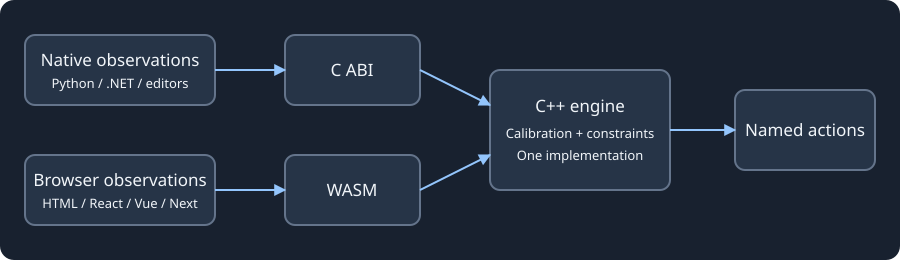

# Motion Input Grid (MIG)

[English](readme.md) | [Français](docs/fr/readme.fr.md)

> [!NOTE]
> MIG is under active development and has just started publishing its first versions.
> All [feedback and suggestions](https://github.com/Robin-G0/Motion-Input-Grid/issues) are welcome.

**Turn a movement into an action.** Draw a route for a wrist or another body part,
then use a camera to recognize it. MIG can send a keyboard shortcut to your desktop
application or report an action to your game, website or Python program.

Use a raised hand to advance a presentation, a movement to control a game, or a
hand sign to run a shortcut. You choose the movements and their bindings.

[**Try the library in your browser**](https://robin-g0.github.io/Motion-Input-Grid/?lang=en)

[**Download**](https://github.com/Robin-G0/Motion-Input-Grid/releases/tag/v1.0.2#user-content-downloads) ·
[**Documentation**](docs/index.md) · [**Examples**](examples/README.md)

[Try MIG](#try-mig-now) · [Downloads](#downloads) · [Desktop](#use-mig-on-your-desktop) · [Integrate MIG](#add-mig-to-your-application) · [Architecture](#explore-the-engine)

## Try MIG now

Each download contains one tutorial, its sources and its dependencies. Extract the
complete archive and follow its README. Allow about 30–60 seconds with prerequisites
installed; initial model loading depends on your hardware.

| Example | Try me | Launch |
| --- | --- | --- |
| [Browser](examples/web/README.md) | [Download](https://github.com/Robin-G0/Motion-Input-Grid/releases/tag/v1.0.2#user-content-web-examples) | `run.cmd` / `sh run.sh`, then open localhost and grant camera permission |
| [Python/Tk](examples/python-tkinter/README.md) | [Windows / Linux](https://github.com/Robin-G0/Motion-Input-Grid/releases/tag/v1.0.2#user-content-python-tkinter-examples) | `main.exe` / `./main`; Python is bundled |
| [SDL2](examples/sdl2/README.md) | [Windows / Linux](https://github.com/Robin-G0/Motion-Input-Grid/releases/tag/v1.0.2#user-content-sdl2-examples) | `mig-sdl2.exe` / `./mig-sdl2`; raise a wrist from green into yellow |

Browser: Node 22.12+ and a modern browser. Native viewers: Visual C++ 2022 x64
runtime on Windows, glibc 2.35+ on Linux. Engine tutorials require their editor
and a tracking provider; they remain **Preview**.

## Downloads

Choose your use case, then an example and platform in the release table.

| Your goal | v1.0.2 downloads |
| --- | --- |
| Create a profile and control an application | [Desktop applications](https://github.com/Robin-G0/Motion-Input-Grid/releases/tag/v1.0.2#user-content-desktop-applications) |
| Try Python, SDL2, SFML or a C++ consumer | [Independent native examples](https://github.com/Robin-G0/Motion-Input-Grid/releases/tag/v1.0.2#user-content-native-examples) |
| Try HTML, React, Vue or Next.js | [Independent browser examples](https://github.com/Robin-G0/Motion-Input-Grid/releases/tag/v1.0.2#user-content-browser-examples) |
| Use Godot, Unity or Unreal | [Engine tutorials and integrations](https://github.com/Robin-G0/Motion-Input-Grid/releases/tag/v1.0.2#user-content-game-engines) |
| Integrate MIG into your project | [SDKs and Python/npm/Debian packages](https://github.com/Robin-G0/Motion-Input-Grid/releases/tag/v1.0.2#user-content-sdks-and-language-packages) |
| Build from source or verify a download | [Source and checksums](https://github.com/Robin-G0/Motion-Input-Grid/releases/tag/v1.0.2#user-content-source-and-integrity-files) |

## Use MIG on your desktop

> [!NOTE]
> On Debian, the configurator, controller and some native examples are still
> being developed and tested. They may not yet work fully.

No code is needed to create and run a movement profile.

1. Download the [**desktop applications archive**](https://github.com/Robin-G0/Motion-Input-Grid/releases/tag/v1.0.2#user-content-desktop-applications) for Windows x64 or Linux x64 and extract it completely.
2. Open the [**configurator**](docs/guides/configurator.md), start the camera,
   draw your movement and save its profile.
3. Open the [**controller**](docs/guides/controller.md), import that profile and
   try the movement. Its row lights up when recognized. Enable **Keyboard output**
   when you want it to send keys to the application you are using.

| Draw a condition | What it means |
| --- | --- |
| 🟩 Required | Pass through this region; numbers define the order. |
| 🟥 Forbidden | Avoid this region. |
| 🟨 Trigger | Finish the movement here. |
| 🟪 Interaction | Make a hand sign here, optionally holding it. |

> [!TIP]
> Try the [standalone camera examples](examples/README.md) first if you just
> want to see tracking work. Raise either hand and watch its feedback, without
> sending any keys.

Desktop archives include the camera runtime and models. Keep their files together.
Windows needs the Visual C++ 2022 x64 runtime; Linux needs glibc 2.35+.
Linux keyboard output requires X11/XTest. See the application guides for launch
paths, calibration, themes and troubleshooting.

## Add MIG to your application

The **C++20 engine is shared by every integration**. Create a JSON profile once
in the configurator, then import it wherever your application runs. Supply body
landmarks yourself, or use an available camera adapter.

Package managers use **`motion-input-grid`**. Technical APIs keep the short name:
Python imports `mig`; CMake exports `MIG::core`.

### Python

```sh
python -m pip install motion-input-grid
python -c "from mig import Tracker; print('MIG ready')"
```

The wheel includes the recognition engine for supplied positions. Camera viewers
use a separate native runtime. [Python usage and frame example](bindings/python/README.md).

### Browser, React, Vue and Next.js

```sh
npm install motion-input-grid
npx mig-copy-assets public/mig
```

The package includes WASM, camera models and framework adapters. Serve the assets
from your application and start tracking after a user click.
[JavaScript usage](bindings/javascript/README.md) · [Framework examples](docs/integrations/javascript.md).

### C++ and game engines

| Integration | Start here |
| --- | --- |
| C++ / CMake / Make | [Install an SDK and link `MIG::core`](docs/getting-started/cpp.md) |
| vcpkg | [Install through the release overlay](ports/motion-input-grid/README.md) |
| Debian / Ubuntu | [Install a downloaded `.deb`](docs/getting-started/packages.md#debianubuntu) |
| Godot | [GDScript add-on and C# examples](integrations/godot/README.md) |
| Unity | [.NET / C ABI UPM package](integrations/unity/README.md) |
| Unreal | [Native C ABI plugin](integrations/unreal/README.md) |

A CMake consumer links the installed SDK like this:

```cmake
find_package(MIG 1.0 CONFIG REQUIRED)
target_link_libraries(my-application PRIVATE MIG::core MIG::format)
```

The [C++ guide](docs/getting-started/cpp.md) includes a complete project, build
commands and runtime requirements. Editor integrations require a landmark
provider; they do not include desktop camera tracking.

## Explore the engine



[Architecture](docs/architecture/overview.md) explains module boundaries and
ownership. The [configuration reference](docs/reference/configuration.md),
[C++ API](docs/reference/cpp.md) and [C ABI](docs/reference/c-abi.md) describe
recognition, live action state and lifecycle contracts.

MIG 1.0.2 provides Windows/Linux x64 desktop applications and Linux ARM64
positions-based SDKs. Engine integrations are Preview. Automated tests cover
recognition and packages; physical cameras, target-game key delivery and editor
exports need separate validation. Check the [support matrix](docs/reference/support.md)
before choosing a platform.

Build from source: [Windows](docs/getting-started/windows.md) ·
[Linux](docs/getting-started/linux.md) · [Portable SDK](docs/getting-started/cpp.md).

[Contributing](CONTRIBUTING.md) · [Changelog](docs/development/CHANGELOG.md) ·
[Roadmap](docs/development/ROADMAP.md) · [Package installation](docs/getting-started/packages.md)

Licensed under [Apache-2.0](LICENSE). Redistributed dependencies retain their notices.

## Tutorials you can copy

Individual `*-standalone` archives put one example and its dependencies in one
folder. Start with its README, then `example_usage.py`/`.hpp` or the named
framework/editor integration file. The browser individual archives need Node
22.12+; the combined JavaScript archive bundles Node. Native individual archives
include their own libraries/models. [Choose a tutorial](examples/README.md).

[Build tools and package contents](tools/README.md) · [Verify an integration](tests/README.md)
